<style>
body {
  font-family: "Oxygen", sans-serif;
  font-size: 14px;
}

h1,h2,h3,h4 {
  font-family: "Raleway", sans-serif;
  font-size: 18px;
}

h4 {
  background-color: #fcfcfc;
  color: #17B491;
  padding: 10px 15px;
}

h5 {
  color:#b45317;
  text-align: center;
  font-size: 18px;
}

</style>


```{r load_library, include=FALSE}
# Use this R-Chunk to load your libraries!
library(mosaic)
library(tidyverse)
library(DT)
```

```{r load_data, include=FALSE}
# Use this R-Chunk to load your datasets!
movies <- read.csv("../../Google Drive/School/Winter 2018/CIT 381/CIT 381 - GroupWork/Unit 2/Data/ReviewsWithSentiment.csv")

table_movies <- movies %>% select(MovieTitle, ReviewDate, ReviewDay, ReviewYear, ReviewMonth, ReviewTextFixed, Sentiment.sentiment, SentimentType)
```

## Our Project {.tabset .tabset-fade .tabset-pill}

Did you know that Roger Ebert (movie critic) didn’t like Footloose?  He called it “seriously confused”.  That didn’t matter to the audiences  They saw it and loved it and many still do.  Do initial reviews of a movie tell how it will be viewed over time?  Do the reviews of a movie change over time?  These are questions we will try to get answers to.

Explore the tabs below from week to week to see what work was done to arrive at our final analysis.

### Project Details (Week 7)

#### Introduction

1. *Determine if movie reviews, positiveness and negativeness,  change over time:* Using historical movie reviews data, determine if initial reviews of a movie will be telling of future success or failure.

2.  *Collaborate effectively as a group for a common goal:* Using collaboration tools of Facebook Messenger, Google Drive and email for communication, we are striving for effective communication to achieve our groups proposed goal.

#### The Problem

The opportunity that we are investigating is that we could be able to tell sooner if a motion picture will be a hit sooner based of the feedback received. This information could help identify features of a movie that make it more likely to become a classic or help increase revenue over time.

#### Potential Dataset

We will be pulling information from IMDB and rottentomatoes via web scraping. These are the links to the websites: [IMDB](www.imdb.com) and [rottentomatoes](www.rottentomatoes.com).

#### Design Document

This design document outlines the deliverables and what week they will be completed in. See a summary of the weeks listed below.

##### Week 7 

1. The deliverable for this week is this document. Provide an outline of all aspects of the project with a goal of the final deliverable. Describe the processes that will be used, possible tools and outcomes.

##### Week 8

__A Usable dataset__

* __Gathering__:
    - We selected a total of six (6) movies via random sample. We will select from two different years, they must be longer than 60 minues and have a popularity of greater than 1000 (IMdB)
    - The movies we sampled were: __American Pysco, Anacondas, Dodgeball, The Polar Express, The Adventures of Rocky and Bullwinkle__, and __Wonderboys__
* __Tools__:
    - We will be using webscraper and R for our analysis
* __Scrape Data__:
    - Using webscraper, we pulled all the text reviews and dates of reviews for each of our movies. 
* __Cleaning__:
    - Normalizing dates: __Austin__
    - Split Date into columns: __Austin__
    - Add Grouping by dates: __Foster__
    - Clean the text:
        1. Remove Punctuation: __Foster__
        2. Add word count: __Gui__
        3. Change to all lowercase: __Gui__ 
* __Profiling Data__:
    1. Check basic data integrity 
    2. Find out whether existing data can be easily used for other purposes
    3. Improve the ability to search data by tagging it with keywords, descriptions, or assigning it to a category
    4. Assess data quality, including whether the data conforms to particular standards or pattern
    5. Assess the risk involved in integrating data in new applications, including the challenges of joins
    6. Discover metadata of the source database, including value patterns and distributions, key candidates, foreign-key candidates, and functional dependencies
    7. Assess whether known metadata accurately describes the actual values in the source database
* __Report Learnings__:
    - Individually report on what you learned from the previous week.

##### Week 9

__Pattern and Visualization__

1. Pro/Con list for patterning and visualization tools: __All__
2. Do pattern and visualizing on dataset
3. Record the learning excerpts about Patterning and Visualizing
4. Report Learnings and reply to others

##### Week 10

__Optimizing, Forecasting, Predicting Deliverables__

1. Research/learn about Optimizing, Forecasting, Predicting
2. Apply learnings to the data set.
     i. Team members need to contribute at least 1 optimization, forecasting, or predicting method/example
     ii. Explain any insights you get from this method.
     iii. Report pros and cons of the tools used for Optimizing, Forecasting or Predicting method/examples
     iv. Record learnings experiences

#### Tools

For this project, we are using some new tools to do our analysis. We will be using R for our data analysis. We are using ‘webscraper’ to collect data from the internet and excel to compile and some reporting for our final analysis.

#### Risks

Some of the risks that we are likely to encounter with this project are that we are using new programs that we have had limited exposure to. This may inhibit the depth of our analysis that we are able to perform. Another risk is that getting full accurate data of the internet may prove challenging if we cannot access the correct sources. The other challenge is that we are working across time zones, so communication is critical and may prove hard to coordinate with varying schedules.

#### Document/Explanation

All of the ddocumentation is detailed within this document.

### Week 8

#### Project Update

We have posted all of our week 7 work and have continued scraping and collecting our data for the following weeks.

#### Deviations

We had to change some movie years since some reviews for movies did not exist in our original year, so we choose movies from years 2000 and 2004. 

#### Tool Learning

__Gui__

Pulling the data from Rotten Tomatoes and imdb was difficult.  I ran into issues with pagination on the web sites.  I also ran into an issue with my CSV files.  They didn’t import into Excel correctly.

Another frustration was switching from web scraper to grepsr.  The second tool was simpler, but the output gave me the csv issue.

__Foster__

I spent a lot of time delving into web scraper.  A lot more time that I expected.  Out new tool grepsr worked, but I felt like switching back to web scraper since is was more powerful and free!  In the end I learned how to deal with two kinds of pagination.  A page forward button and a “Load More” button.  I also had to learn how to group items to form an element so that the dates came with the correct review.

__Austin__

From our group, I believe that we learned that communication and setting specific time to meet is extremely helpful. Following up is also very helpful as well so that we make sure all our points get covered for the week.

Profiling our data: To make sure that our data was complete and accurate, we used data directly from the source to compile our dataset. Since we didn’t perform any transformations or complex joins, we feel assured that our data is usable for purposes of this analysis.

__All__

We had an issue with available data.  Originally, we expected to get movie data from Rotten Tomatoes for a 1980 movie.  The problem was that Rotten Tomatoes was not started until 1998.  To solve this, we changed the movies we used to a year after Rotten Tomatoes was started.

From this week, we performed a lot a cleaning on our data. We formatted the dates in our dataset and split them up to get month day and year values for different grouping methods. We also cleaned up the text in order to do sentiment analysis on our data. We also compiled our text reviews so that we had it neat and orderly for our analysis.

#### Cleaning Methods

We used excel to clean the majority of our data. We also used functions in R to clean our data as well. See the "Data" tab to see a what our data looked like after being cleaned.

#### Document/Explanation

All documentation is contained within this docuement.

### Week 9

#### Project Update

We have completed the cleaning of our document and are moving on to creating some visualizations, finding patterns and/or outliers.

#### Deviations

We had to make some modifications to what type of reviews we were looking for in order to find more relevant reviews to what we were looking for. For example, we decided that, in addition to critic reviews, we also needed to pull user reviews to make sure that we were fully analyzing the sentiment of the movie and not just from one, potentially biased, side. 

#### Tool Learning

Using new tools is a challenge, we discovered the following when using our analysis tool to run our reports.

* __R:__ 
    - _Pros:_ It is really good at creating charts and running functions.
    - _Cons:_ but not everyone on our team knew how to use it and it made explaining parts of the tool difficult.

* __Excel:__
    - _Pros:_ It is easy to use for a majority of applications. It was covered in class extensively and used for many of the projects. Our team had a solid understanding of how it works and how to do our analysis in it.
    - _Cons:_ Not as powerful as other software (i.e. Extra steps required, additional add-ons, etc). Has limits in the types of charts it can create.

#### Patterns - Outlier - Visualization

__Foster__

In this visual, we are looking for patterns in when the reviews were entered.  Trying to understand if time of year influenced number of reviews

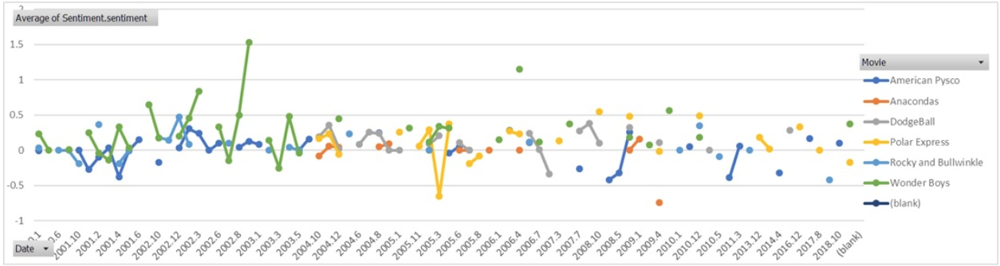

<br>
This visual, made in R, looks for the same pattern as above - when were reviews entered.

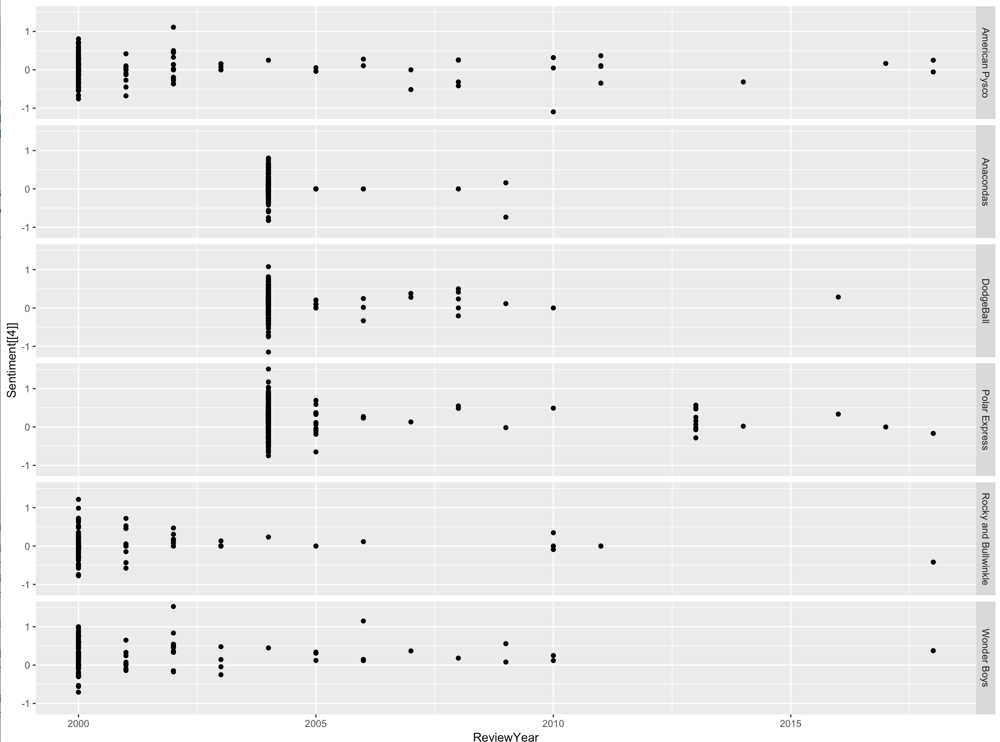

<br> 
This chart helps see what reviews were negative and which were positive.

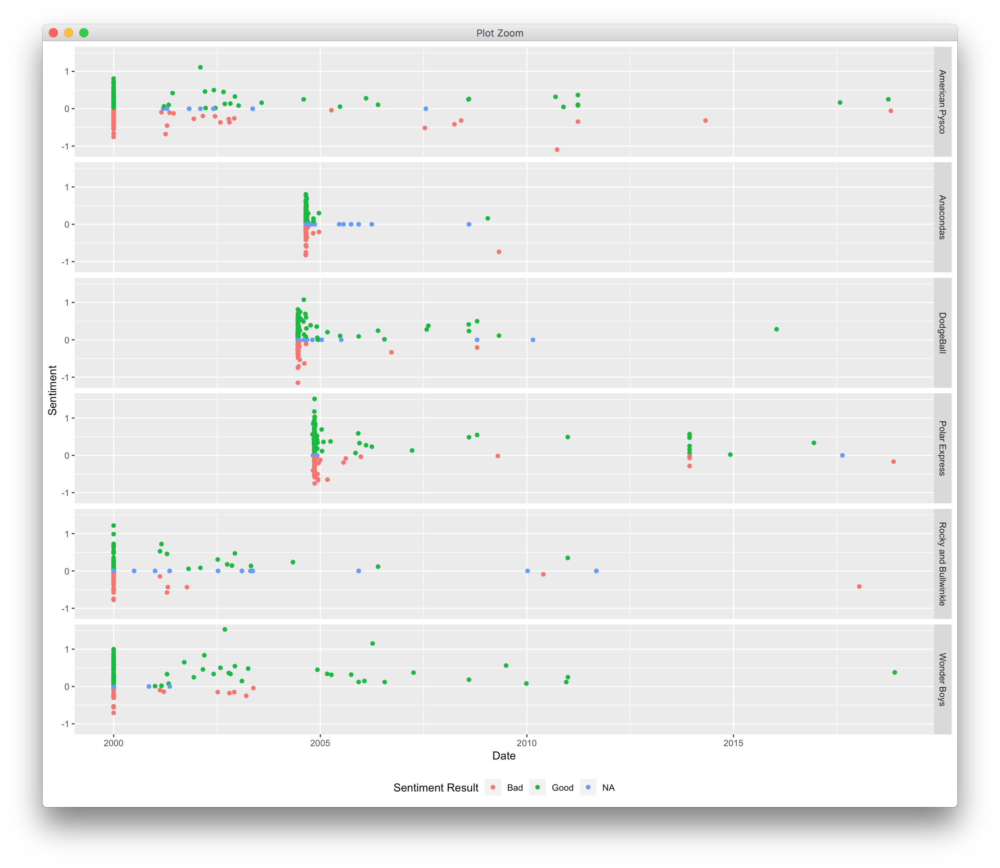

__Austin__

When looking at the day a review was left, does the day of the week make a difference? It looks like most critics get there reviews out fairly quick, the Saturday the movie was released. 

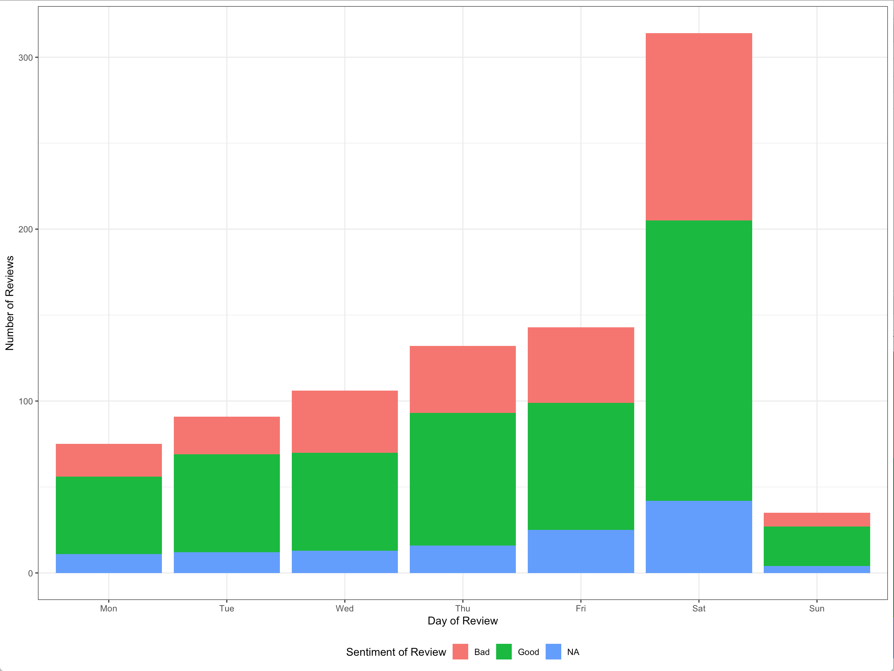

For the second visualization, I wanted to see the reviews stacked on top of each other. So This groups the movie by year and shows the total number of reviews by year and which ones were bad and which ones were good.

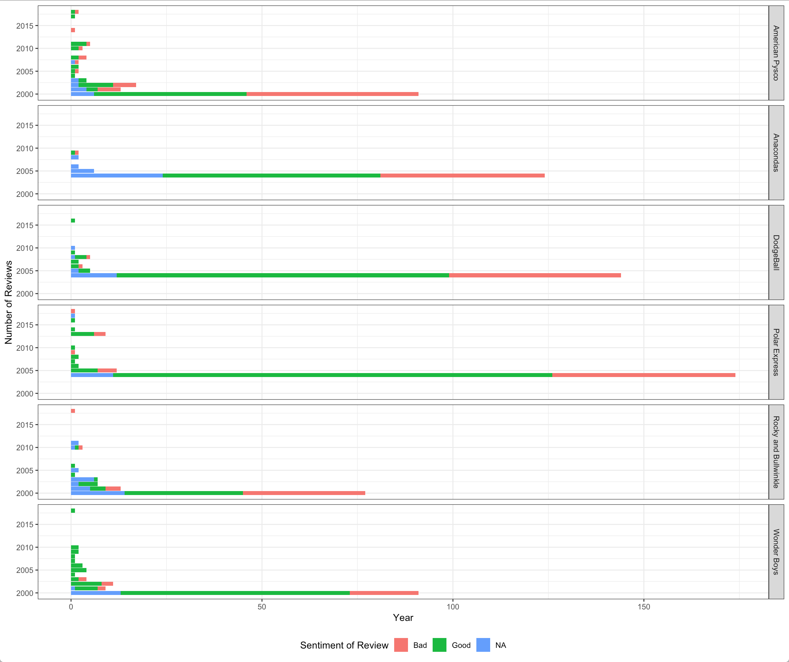

__Gui__

It is fun to look at the data.  Visuals help identify areas to drill into.  There are more questions after looking at the visuals than there were before.  More digging to do!

#### Document/Explanation

* There was a lot of overlapping travelling which made it difficult to coordinate times with the members during this week. 

* Learning new tools also proved to be fairly challenging as we began to learn them. It was helpful to have a team member who was familiar to use the tool. It made getting deliverables done more efficient.

### Week 10

#### Project Update

We are looking at optimizing our data sets and performing some forecasting to our analysis as well. See the attached spreadsheet for our forecasting example.

#### Deviations

None for this section.

#### Tool Learning

We used R more in depth this week. We wanted to recreate some of the cleaning, visualization, and reporting methods that we had used in excel, but in R, to see if we could change how we did our processes in order to make our project run smoother or faster. We found that R is a powerful tool, but can also be complicated. There is a learning curve to it, but it can do all of what excel can do and ususally a lot quicker.

#### Optimization  - Forecasting - Predicting Method

**Foster**

*Research/learn about Optimizing, Forecasting, Predicting*

I chose to try to use R for forecasting/predictions this week.  I re-learned what a time series was and how to create one in R.  Running a prediction is very easy once you have data formatted correctly, but the tool I used was very picky.  I used the Holtwinters prediction function in R.  It required the time series to have two columns names ds and y.
This week I also learned a lot from Austin.  He helped me with my data in R.

*Optimization, forecasting, or predicting method/example*

I did a prediction model in R using the HoltWinters function.  From it you can see the seasonality on the forecast plot and the predicted plot of the data in the future.  Both plots are included for your viewing pleasure.  I believe we could predict the seasonality of any movies reviews after seeing the forecast and prediction work that I did.

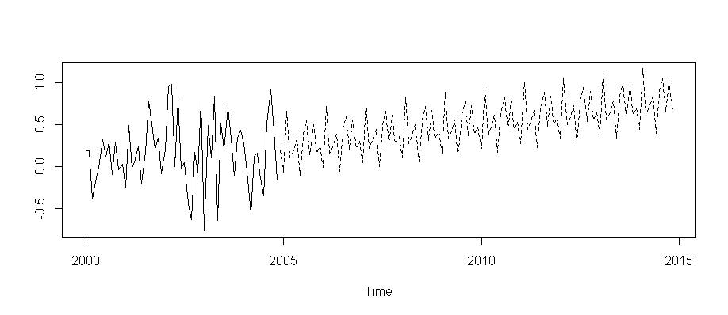

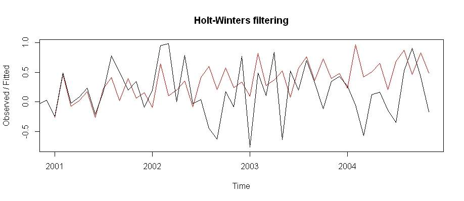

**Guilherme**

*Research/learn about Optimizing, Forecasting, Predicting*

I researched some methods to forecast data using excel. Before the 2006 version it was not so easy to forecast data using excel, but now, there are new methods and functions to assist the user to do the predictions with his dataset. 

*Optimization, forecasting, or predicting method/example*

I used the excel to forecast the sentiment analysis we have for the Anaconda dataset. My focus was to learn how to do this analysis and to build it accordingly. First of all, I filtered the critic and users reviews with the sentiment analysis and separate them in a new sheet. I then created the forecast to predict reviews for year of 2019 using the past years reviews.

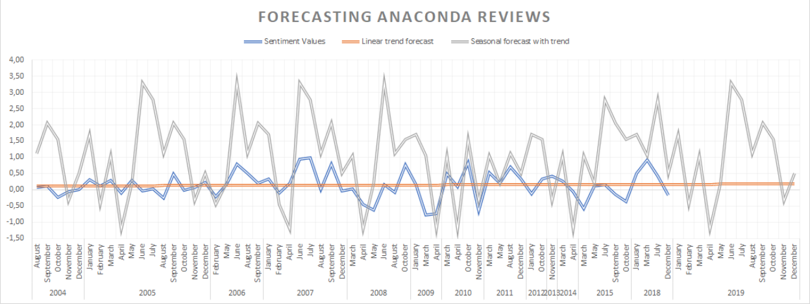

I also used the Forecasting sheet in Data tab function Forecasting. This method was the easiest, since I just needed to prepare the table and click in forecast.

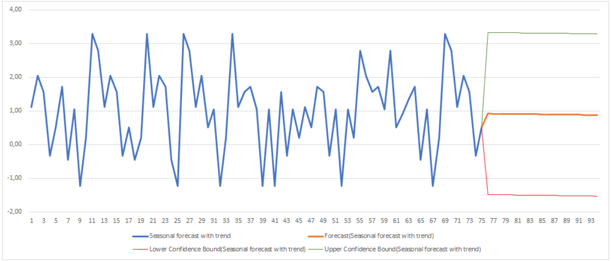

*Make sure to explain any insights you got from doing the method*

Guilherme- The method is useful. Although there were some tutorials in the internet, it took some time to get the result.

*Report on the pros and cons of the tool used for Optimizing, Forecasting, Predicting*

Guilherme- Pros: Excel was easy to use and there were some tutorials in the internet to help to create the forecasting. It was also nice to see the forecasting sheet analysis working.
Cons: It was hard to prepare the data with the sentiment analysis. We used R to do the sentiment and excel to do this forecasting.

*Record the learning excerpts about Optimizing, Forecasting, Predicting*

Guilherme- Forecasting is really important. I think it is worth of a deep study and learning with some other tools, like R.

**Austin**

*Research/learn about Optimizing, Forecasting, Predicting*

One of the area's that I researched are how can we optimize the way we are storing data for better reporting and analysis. One of the intersting articles I came across gives an overview of some methods used for optimizing forecasts and analysis. It can be found here [(Article)](https://risnews.com/advanced-planning-and-optimization-part-7-forecasting-and-optimization-tools). After reading that article, I decided to dive deeper into some of R's reporting methods. In one of their exerpts, they mention that inaccesible and unusable reports are the first roadblock for many data driven decisions, so I wanted to make sure that our dataset was accesible to anyone looking at the report.
Something that I learned from my teammates this week was being able to use excel to do some forecasting. It was helpful to see their different viewpoints and thought processes on how to look at the data.

*Optimization, forecasting, or predicting method/example*

For this example, click the "Data" Tab above to see how the dataset is embedded into this worksheet and available for anyone to view. Another optimization that we did was creating this report document. I wanted to move from a word document to what is referred to as R markdown. This style of report (the one you are reading and using now), makes for a much more readable and professional report that is more flexible to adding in analysis then a word document.

```{r}
average_sent <- movies %>% group_by(MovieTitle) %>% summarise(average = mean(Sentiment.sentiment))

average_sent
```

*Make sure to explain any insights you got from doing the method*

R is very powerful and I found myself slightly overwhelmed narrowing down how I wanted to do some reporting and styling. What I discovered was that R makes placing charts, graphs and tables within a document much easier and flexible than other programs, like word. Additionally, you can export your work to others in almost any format you want, making it flexible and accesible.

*Report on the pros and cons of the tool used for Optimizing, Forecasting, Predicting*

**Pros:** Powerful! It can do anything you want and usually a lot quicker and easier than excel. It has a lot of tools, add ons and packages that make it flexible to any project.

**Cons:** There is a huge learning curve in getting things up and running. Its not just point and click as it is in other programs.

*Record the learning excerpts about Optimizing, Forecasting, Predicting*

Data storage is very important, and needs to be done consistently across teams to make sure you are using valid data and that other people can verify the work that you do.

---

**Group**

For our optimization, we looked further into our datasets to see what improvements we could make to make our data tell more about the reviews we were seeing. We discovered a lot of interesing things in our dataset, particularly, seasonality. Take a look at a screenshot exerpt below from our forecast:

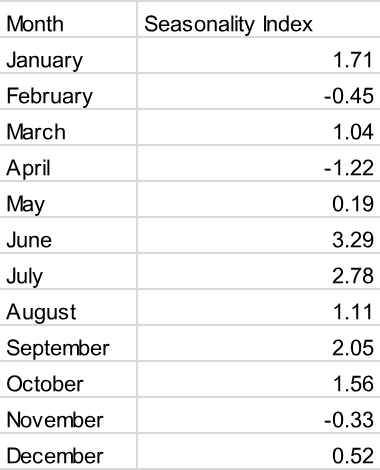

Something interesting here is that we see a consistant uptick in sentiment from reviews in June and a consistent dip in the end of the year. (See the attached excel sheet for a more detailed chart).

Futhermore, we created some additional charts with user and critic reviews to further understand our data. Here is an example:

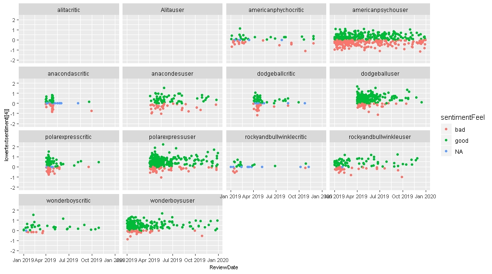
This contains both the critic and user reviews over time. We can see that users are active on commenting on movies much longer after critics are.


We also did some charting in excel to see if we could find any other insights in our data.

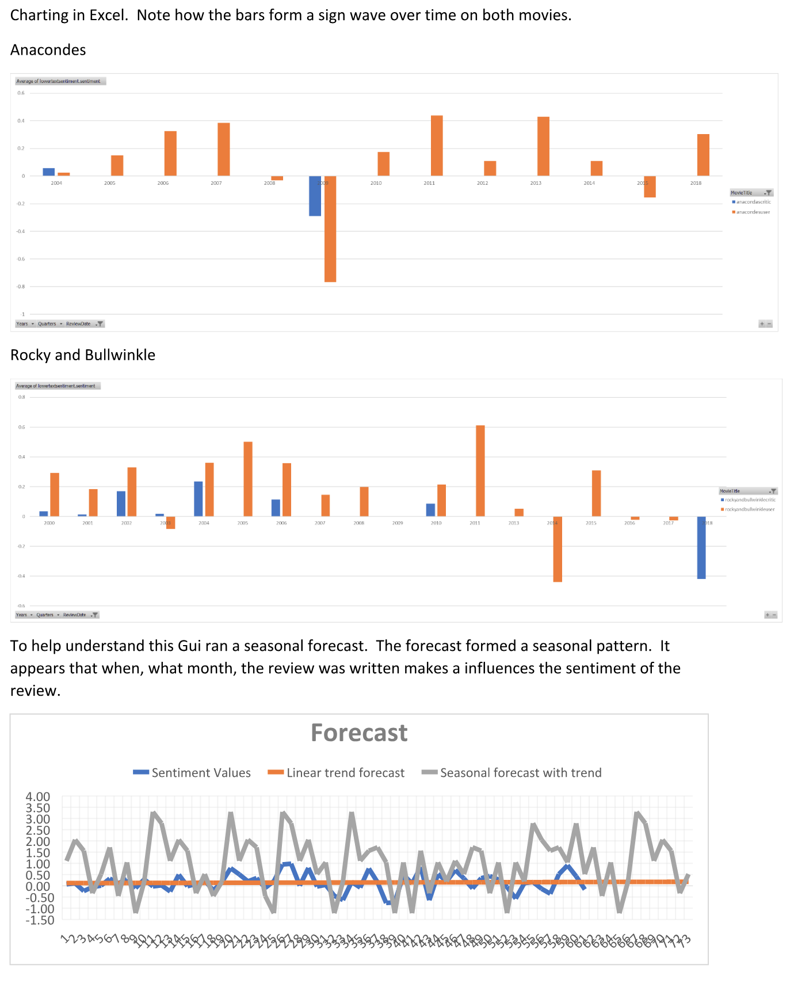

#### Document/Explanation

We found a lot of interesting aspects from our data. Of which, that it is hard to predict movie sucess based on the reviews of a movie. However, the initial reviews typically indicate if a movie is good or not in the long run. For example, if a movie recieves _generally positive_ reviews during its initial release, then it will typically continue to receive _generally positive_ reviews.

Just using our sentiment score to average out each sentiment, we get the following averages.

```{r}
average_sent %>% 
  kableExtra::kable() %>% 
  kableExtra::kable_styling(bootstrap_options = c("striped", "hover"))
```

We can compare this with the chart above and see that movies that start with more positive reviews do typically continue to recieve positive reviews. While this is not noteably 'new' information, it is interesting that we can identify such trends from a small subset of data.


### Data

Here is the clean data we used to generate the graphs in this document. 

```{r}
table_movies %>% 
  kableExtra::kable() %>% 
  kableExtra::kable_styling(bootstrap_options = c("striped", "hover"))
```


